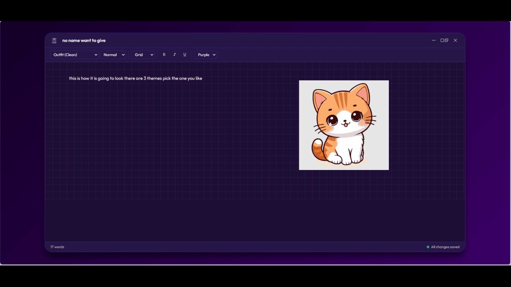

# 🌸 NoteBloom — Cute Study Notebook Widget

> A beautifully designed, installable Progressive Web App for students to take notes, paste screenshots, and stay organized during online lectures and meetings.

[](https://sammmiksha.github.io/notebloom/)
[](https://sammmiksha.github.io/notebloom/)
[](#)

---

## 📸 Screenshots

<table>
  <tr>
    <td>
 </td>
    <td></td>
  </tr>
</table>

<table>
  <tr>
    <td></td>
    <td></td>
  </tr>
</table>

> **Tip:** The app adapts its layout depending on window size — snap it beside your lecture video for a distraction-free note-taking experience!

---

## 🧮 Floating Study Calculator

NoteBloom now includes a built-in **Study Calculator** that floats over your notes — drag it anywhere on screen, crunch numbers without switching apps, and keep writing without breaking your flow.


> The calculator remembers its position and open/closed state between sessions, so it's right where you left it every time.

---

## ✨ What is NoteBloom?

NoteBloom is a **lightweight, offline-capable note-taking app** built specifically for students. Whether you're in a Zoom lecture, watching a recorded session, or sitting in a live class — NoteBloom keeps your notes organized in one cute, distraction-free space.

You can:
- Create multiple **notebooks** for different subjects or courses
- Write notes with rich text formatting (bold, italic, underline)
- **Paste screenshots directly** from your clipboard into your notes
- Choose between **page styles** (Blank, Ruled, Grid, Dot Grid) to match how you think
- Switch between multiple **themes** to personalize your workspace
- Use the built-in **floating Study Calculator** without leaving your notes
- Work **completely offline** — no internet needed after install
- **Install it like a native app** on Windows, Mac, Android, or iOS via Chrome

---

## 🚀 Getting Started

### Option 1: Use in Browser (No Install)

1. Visit **[https://sammmiksha.github.io/notebloom/](https://sammmiksha.github.io/notebloom/)**
2. Start using it immediately — no sign-up required.

### Option 2: Install as a Desktop / Mobile App (Recommended)

Installing NoteBloom as a PWA gives you a native-feeling app with offline access.

**On Desktop (Chrome or Edge):**
1. Open [https://sammmiksha.github.io/notebloom/](https://sammmiksha.github.io/notebloom/) in Chrome or Edge.
2. Look for the **install icon** (➕) in the address bar, or open the browser menu (⋮) and click **"Install NoteBloom"**.
3. Click **Install** in the prompt.
4. NoteBloom will appear in your **Start Menu**, **Taskbar**, or **Desktop** like any native app.

**On Android (Chrome):**
1. Open the site in Chrome.
2. Tap the menu (⋮) → **"Add to Home Screen"**.
3. Tap **Add**. The app icon will appear on your home screen.

**On iOS (Safari):**
1. Open the site in Safari.
2. Tap the **Share** button (box with arrow) → **"Add to Home Screen"**.
3. Tap **Add**.

> ℹ️ Once installed, NoteBloom works fully offline. Your notes are saved locally on your device.

---

## 📖 How to Use NoteBloom

### Creating a Notebook
1. From the dashboard, click **"+ New Notebook"**.
2. Enter a name for your notebook (e.g., "Physics Lectures", "CS101").
3. Your new notebook will appear as a card on the dashboard.

### Opening and Writing Notes
1. Click on any notebook card to open it.
2. Start typing your notes in the editor.
3. Use the toolbar to apply **Bold (B)**, *Italic (I)*, or Underline (U) formatting.
4. Notes are **auto-saved** — you'll see "All changes saved" in the bottom-right corner.

### Choosing a Page Style
Use the dropdown in the toolbar to switch between:
- **Blank** — clean white canvas
- **Ruled** — horizontal lines, classic notebook style
- **Grid** — square grid, great for diagrams and math
- **Dot Grid** — subtle dots, popular for bullet journaling

### Changing Themes
Use the theme dropdown (e.g., **Purple**) to change the color scheme of your editor. Pick the vibe that matches your mood or subject.

### Pasting Screenshots
1. Take a screenshot on your device (`Win+Shift+S` on Windows, `Cmd+Shift+4` on Mac).
2. Click inside your note area.
3. Press **Ctrl+V** (or **Cmd+V** on Mac) — the screenshot pastes directly into your note.

### Using the Study Calculator
- Click the **calculator FAB** (floating action button) in the bottom-right corner of the editor to open the Study Calculator.
- On desktop, drag it anywhere on screen — it stays put between sessions.
- On mobile, it opens as a bottom-sheet panel so it never blocks your writing area.
- Type math expressions directly in your notes (e.g., `6 + 4 =`) and they evaluate inline — works on both desktop and mobile keyboards.

### Renaming or Deleting a Notebook
- On the dashboard, each notebook card shows **Rename** and **Delete** options beneath it.
- Click **Rename** to give it a new title, or **Delete** to remove it permanently.

### Searching Your Notebooks
- Use the **Search bar** at the top of the dashboard to quickly find notebooks by name.

---

## 🎨 Features Overview

| Feature | Details |
|---|---|
| 📒 Notebook Management | Create, rename, and delete multiple notebooks |
| 🎨 Themes | Multiple color themes to personalize your workspace |
| 📄 Page Styles | Blank, Ruled, Grid, Dot Grid |
| 🖼️ Screenshot Pasting | Paste images from clipboard directly into notes |
| 💾 Auto-Save | Notes saved automatically using IndexedDB (browser storage) |
| 🔍 Search | Search across notebooks instantly |
| 🧮 Floating Calculator | Draggable Study Calculator with session persistence |
| ➗ Inline Math | Type `6 + 4 =` in your notes and get the result instantly |
| 📱 PWA / Installable | Install on desktop or mobile like a native app |
| 🌐 Offline Support | Works without internet after first load |
| 🔠 Rich Text | Bold, Italic, Underline formatting |
| 📏 Font & Size Controls | Adjust font family and size from the toolbar |

---

## 🛠️ Tech Stack

| Technology | Purpose |
|---|---|
| **HTML5** | App structure and markup |
| **CSS3** | Styling, themes, animations |
| **Vanilla JavaScript** | All app logic and interactions |
| **IndexedDB** | Local persistent storage for notes and notebooks |
| **Service Workers** | Offline support and caching |
| **Web App Manifest** | PWA installability (icons, name, theme color) |
| **GitHub Pages** | Free static hosting for the live demo |

No frameworks, no backend, no server — NoteBloom runs entirely in your browser with zero dependencies.

---

## 🗂️ Project Structure

```
notebloom/
├── assets/
│   ├── icon-192.png                    # PWA icon (small)
│   ├── icon-512.png                    # PWA icon (large)
│   ├── screenshot-wide.png             # Wide editor screenshot
│   ├── screenshot-narrow.png           # Narrow editor screenshot
│   └── screenshot-calculator-float.png # Floating calculator screenshot
├── app.js                    # Core app logic & notebook management
├── database.js               # IndexedDB storage layer
├── editor.js                 # Note editor logic (formatting, page styles)
├── index.css                 # Global styles and themes
├── index.html                # Main app entry point
├── manifest.json             # PWA manifest (icons, name, theme color)
└── service-worker.js         # Offline support and caching
```

---

## 📋 Changelog

### v1.1.0 — Floating Calculator & Mobile Polish

#### 📱 Mobile Math Solver Fix
- Fixed automatic inline math evaluation on mobile devices
- Expressions like `6 + 4 =`, `7 × 7 =`, and `12 / 3 =` now evaluate correctly on Android and iOS virtual keyboards
- Added input-event based detection for `=` while preserving existing desktop keyboard support

#### 🧮 Responsive Study Calculator
- **Desktop:** Replaced the fixed sidebar calculator with a draggable floating window; position and open/close state persist between sessions
- **Tablet:** Calculator appears as a floating utility panel with a simplified interaction model
- **Mobile:** Calculator opens as a bottom-sheet panel so the full writing area stays usable

#### ✨ UX Improvements
- Added a Floating Action Button (FAB) for quick one-tap calculator access
- Improved editor workspace utilization by removing the old split-screen layout
- Calculator close button and header controls added
- Improved responsive behavior across desktop, tablet, and mobile

#### 🎨 Theme Improvements
- Calculator now integrates cleanly with all existing themes
- Consistent styling between editor and calculator components
- Theme system prepared for upcoming dark mode support

#### 💾 Persistence Improvements
- Calculator visibility state remembered between sessions
- Calculator position restored automatically on desktop
- All existing notebook data remains fully compatible — no migration needed

#### 🚧 Experimental (In Development)
The following features are in active development and not part of the stable release:
- Bookshelf-based notebook organization system
- Notebook spine and front-cover display modes
- Multi-shelf notebook arrangement
- Shelf customization and positioning controls
- Enhanced notebook visual themes

---

## 💡 Tips & Tricks

- **Snap it beside your lecture!** Resize NoteBloom to a narrow window and snap it next to your video — it's designed to look great at any width.
- **Use Grid pages for diagrams and equations** — the grid lines make freehand sketching in notes much cleaner.
- **Organize by subject** — create one notebook per course so your notes never get mixed up.
- **Screenshot workflow** — during a Zoom or Teams call, use your OS snipping tool and paste straight into your note without breaking flow.
- **Keep the calculator handy** — drag it to a corner and leave it open; it'll be right there next session.

---

## 🔮 Roadmap / Future Improvements

- [ ] Always-on-top window mode (keep NoteBloom above your lecture window)
- [ ] Electron desktop version (deeper OS integration)
- [ ] Export notes as PDF or Markdown
- [ ] More notebook cover themes and colors
- [ ] Tagging and folder organization
- [ ] Dark mode support
- [ ] Handwriting / stylus input support
- [ ] Bookshelf-based notebook organization *(in development)*

---

## 🤝 Contributing

Contributions, issues, and feature requests are welcome! Feel free to open an issue or submit a pull request.

1. Fork the repository
2. Create your feature branch: `git checkout -b feature/your-feature-name`
3. Commit your changes: `git commit -m 'Add some feature'`
4. Push to the branch: `git push origin feature/your-feature-name`
5. Open a Pull Request

---

## 📄 License

This project is open source and available under the [MIT License](LICENSE).

---

<div align="center">
  Made with 🌸 for students, by a student
  <br/>
  <a href="https://sammmiksha.github.io/notebloom/">Try NoteBloom Live →</a>
</div>
